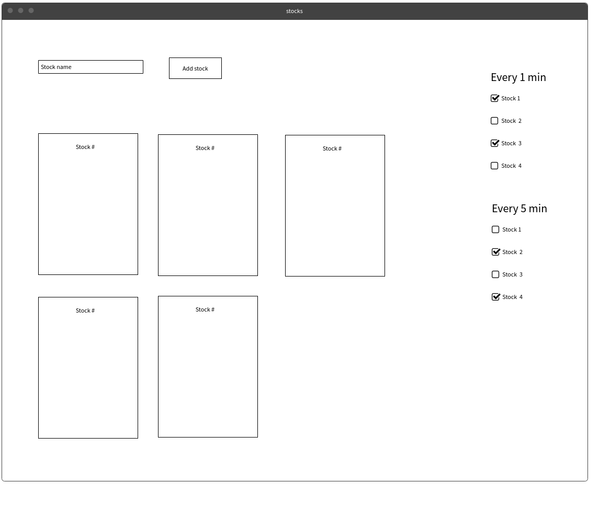

# Stocks api with Advanced JS
We are taking the stocks exercise from hw17 and we are making the same application with advanced JS technics.

## What to do
- use bootstrap
- make function constructor for stock
- make factory to build new object, the factory will have `stock` and `etf`
- make `observer` pattern to register stocks to update interval

## Steps to achieve the goal
- first build the html (dynamic) from the stocks array (write a function that takes the stocks array and build the html)

## Bonus
- mapper that receives objet from api and mapping it to stock object

   
